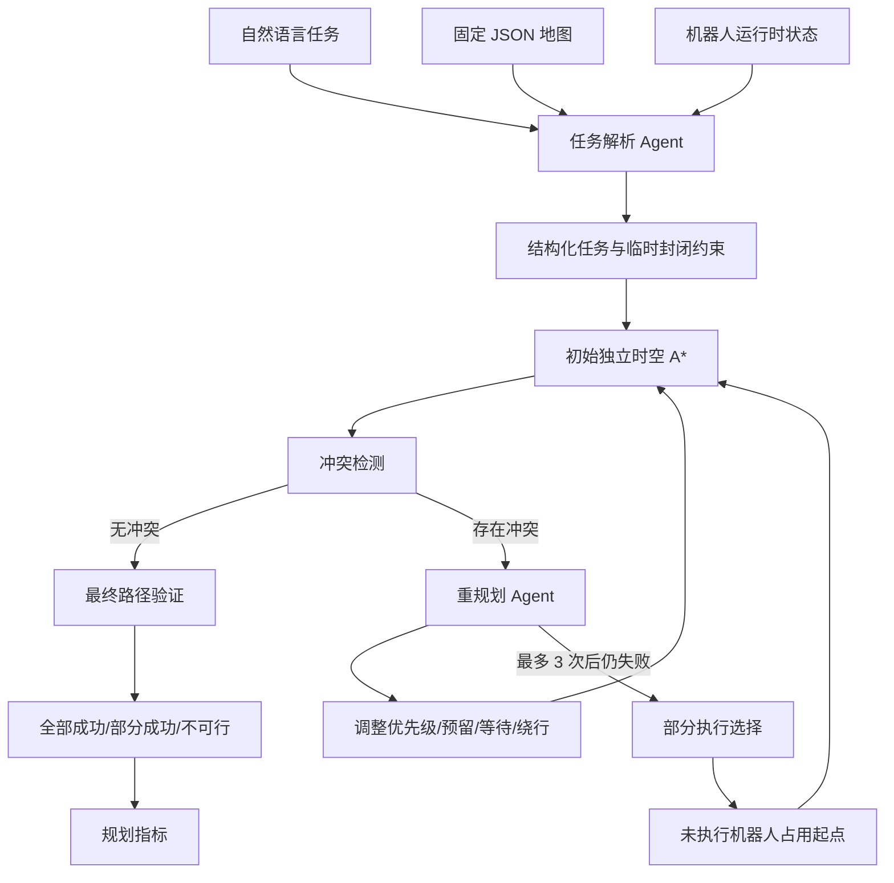

# 智能仓储机器人调度系统

将自然语言仓储任务转换为多机器人无碰撞时空路径的智能调度系统。

**当前状态：** MVP 已实现，支持自然语言（DeepSeek）和结构化 JSON 两种输入方式，93 个测试全部通过。

## 项目简介

本项目面向固定仓库网格地图中的多机器人调度场景。用户可以使用自然语言描述多个机器人要前往的目标，并同时声明临时封闭通道等运行时约束。系统负责将这些描述解析为结构化任务，调用确定性的路径规划与冲突检测工具，最终输出全部成功、部分成功或不可行的调度结果。

示例指令：

> 仓库中有 3 台机器人，R1 从左上角前往装卸区 A，R2 前往货架 B，R3 前往充电区，北侧通道临时关闭。

系统需要从固定地图和机器人运行时状态中解析：

- 机器人 ID；
- 起点坐标；
- 目标区域及候选入口格；
- 任务优先级；
- 临时封闭约束。

与直接让大模型生成路径相比，本项目采用：

- Agent/LLM 负责自然语言理解和重规划决策；
- A*、冲突检测、预留表和路径验证负责确定性求解；
- 所有成功结果都必须经过程序验证。

目标用户尚未形成完整角色定义。当前主要使用场景是仓储调度或运维人员，以及调用调度能力的上层系统。

## 核心能力

### MVP 能力

- 从固定 JSON 文件加载纯网格仓库地图；
- 读取机器人当前位置和运行时临时封闭；
- 将自然语言解析为结构化机器人任务；
- 解析用户指令中的临时封闭通道或坐标；
- 使用时空 A* 生成带时间步的路径；
- 支持上、下、左、右移动和原地等待；
- 检测起点、终点、顶点和交换冲突；
- 通过优先级调整、预留表、等待和绕行最多重规划 3 次；
- 在全部任务无法共同执行时，返回经过重新验证的部分执行方案；
- 输出路径规划成功率和规划耗时等指标。

### 已规划但不属于 MVP

- 真实机器人任务下发；
- 执行状态回传；
- 实际任务完成率；
- 在线动态重调度；
- 更完整的 UI、API、鉴权、部署和监控；
- 在更大规模或更高完备性要求下使用 CBS/ECBS；
- 不同机器人尺寸、速度和转向成本。

### 明确不在当前版本范围内

- 随机地图；
- 随机场景生成器；
- 100 组随机场景批量评估模块；
- 基于随机场景的场景成功率和冲突率；
- 对角线移动；
- 直接使用 LLM 生成未经验证的路径。

## 工作原理



处理流程：

1. 加载固定网格地图；
2. 加载机器人当前位置和已有临时封闭；
3. 解析用户自然语言中的任务与封闭约束；
4. 为每台机器人执行初始独立规划；
5. 检测多机器人冲突；
6. 最多进行 3 次重规划；
7. 全量任务仍不可行时，选择最大可执行任务子集；
8. 将未执行机器人视为持续占用其当前位置；
9. 对部分任务集合重新规划并验证；
10. 输出结果和指标。

## 已确认的业务规则

- 地图是固定的二维纯网格；
- 坐标统一使用 `[x, y]`；
- 机器人只能四方向移动；
- 允许原地等待；
- 所有机器人占据一个网格；
- 所有机器人速度一致，每个时间步移动一格；
- MVP 不考虑转向成本；
- 正式路径包含时间维度 `(x, y, t)`；
- 用户指令可以包含临时封闭；
- 未指定时间范围的临时封闭对本次规划全过程有效；
- 机器人到达终点后持续占用终点；
- 顶点冲突和交换冲突必须被检测；
- 重规划最多 3 次；
- 允许部分执行；
- 未执行机器人持续占用当前位置；
- 规划成功不会自动更新真实机器人位置；
- MVP 只统计路径规划成功率；
- 最终版本同时统计路径规划成功率和实际任务完成率。

## MVP 范围

### MVP 目标

完成一个可验证的端到端规划闭环：

```text
自然语言
→ 结构化任务
→ 时空路径
→ 冲突检测
→ 最多 3 次重规划
→ 全部成功/部分成功/不可行
→ 路径规划成功率和耗时
```

### MVP 包含

- 固定地图 JSON；
- 机器人运行时位置；
- 语义位置和别名解析；
- 临时封闭约束；
- 时空 A*；
- 预留表；
- 顶点与交换冲突检测；
- 路径验证；
- 反思与重规划；
- 部分执行；
- 规划指标。

### MVP 不包含

- 机器人执行器；
- 真实执行状态；
- 实际任务完成率；
- 随机测试场景生成；
- 100 组批量评估报告；
- Web UI；
- 完整账号和权限系统；
- 已确定的生产部署方案。

### MVP 验收标准

- 支持的自然语言指令可以被解析为结构化任务；
- 未提供的起点可以从机器人运行时状态补全；
- 目标位置可以通过地图语义位置和入口格解析；
- 不得编造未知坐标；
- 成功路径连续且不经过障碍；
- 成功路径不存在顶点冲突或交换冲突；
- 到达终点后的持续占用得到正确处理；
- 最多只重规划 3 次；
- 部分执行方案重新规划并重新验证；
- 路径规划成功率按用户输入任务数计算。

## 项目架构

### 已确认架构

本项目采用 LangGraph 编排 + 确定性工具的模块化架构。调度流程由编译后的 StateGraph 驱动，每个处理阶段为独立节点函数。

```text
START
  ↓
parse_instruction (TaskParserAgent / LLM)
  ↓
validate_and_resolve_goals
  ↓
build_obstacles
  ↓
initial_plan (独立 A*)
  ↓
conflict_check ──→ 无冲突 ──→ validate_final ──→ compute_metrics → END
  ↓                                   ↑
  ├─ 有冲突 → replan_decide → apply_replan ──┘ (最多 3 次)
  └─ 不可解 → partial_execution ──→ validate_final
```

| 模块 | 文件 | 职责 |
|------|------|------|
| Graph 构建器 | `app/orchestration/graph_builder.py` | build_graph() 构建 StateGraph，定义节点、条件路由和循环边 |
| Graph 节点 | `app/orchestration/graph_nodes.py` | 10 个纯函数节点 |
| Workflow | `app/orchestration/workflow.py` | 封装编译后 Graph，对外保持 PlanningState 接口 |
| GraphState | `app/domain/graph_state.py` | 22 字段 TypedDict，累积字段使用 operator.add reducer |
| 任务解析 Agent | `app/agents/task_parser_agent.py` | DeepSeek LLM 自然语言→结构化任务 |
| 重规划 Agent | `app/agents/replanning_agent.py` | 冲突诊断与 3 级重规划决策 |
| 重规划策略 | `app/orchestration/replanning_policy.py` | 执行重规划（预留表 + 优先级调整） |
| 地图加载器 | `app/services/map_loader.py` | 加载和校验固定 JSON 地图 |
| 位置解析器 | `app/services/location_resolver.py` | 名称和别名解析为语义位置与入口格 |
| 时空 A* | `app/tools/astar_planner.py` | 搜索单机器人时空路径 |
| 预留表 | `app/tools/reservation_table.py` | 记录高优先级机器人的顶点和边占用 |
| 冲突检测器 | `app/tools/conflict_detector.py` | 顶点、交换、起点和终点冲突检测 |
| 路径验证器 | `app/tools/path_validator.py` | 验证路径连续性、障碍、起终点和多机安全 |
| 指标收集器 | `app/services/metrics_collector.py` | 汇总成功率、耗时、冲突和重规划信息 |

### 当前倾向

- 使用 LangGraph StateGraph 作为编排引擎；
- 通过编译后的 Graph 执行全流程，每个阶段为独立纯函数节点；
- 使用优先级规划和预留表处理 3 至 5 台机器人；
- 固定地图和运行时状态分成两个 JSON 文件；
- 对部分执行使用有限任务子集搜索；
- 对外提供结构化请求和响应（当前为 CLI + Python API）。

### 待确认

- 编程语言；
- Agent 框架和模型供应商；
- 后端或 CLI 框架；
- 数据持久化；
- API 形式；
- 部署平台；
- 监控和日志系统。

## 地图 JSON 设计

地图必须从固定 JSON 文件读取。下面是当前建议的结构，最终字段名和文件拆分仍待确认。

### 固定地图

建议文件名：`configs/warehouse_map.json`

```json
{
  "schema_version": "1.0",
  "map": {
    "map_id": "warehouse_main",
    "name": "主仓库地图",
    "width": 10,
    "height": 10,
    "cell_size_m": 1.0,
    "coordinate_system": {
      "format": "[x, y]",
      "origin": "top_left",
      "x_direction": "right",
      "y_direction": "down"
    }
  },
  "movement": {
    "allow_up": true,
    "allow_down": true,
    "allow_left": true,
    "allow_right": true,
    "allow_wait": true,
    "allow_diagonal": false,
    "move_cost": 1.0,
    "wait_cost": 1.0
  },
  "static_obstacles": [
    {
      "obstacle_id": "shelf_group_01",
      "type": "shelf",
      "cells": [[5, 4], [5, 5], [5, 6]]
    }
  ],
  "locations": [
    {
      "location_id": "loading_zone_a",
      "name": "装卸区A",
      "aliases": ["A装卸区", "装卸A区"],
      "type": "loading_zone",
      "facility_cells": [[9, 2]],
      "entry_cells": [[8, 2]],
      "capacity": 1
    },
    {
      "location_id": "charging_zone",
      "name": "充电区",
      "aliases": ["充电站", "充电区域"],
      "type": "charging_zone",
      "facility_cells": [[1, 9], [2, 9]],
      "entry_cells": [[1, 8], [2, 8]],
      "capacity": 2
    }
  ],
  "corridors": [
    {
      "corridor_id": "corridor_north",
      "name": "北侧主通道",
      "cells": [[0, 1], [1, 1], [2, 1], [3, 1], [4, 1]]
    }
  ]
}
```

设计要点：

- 设施本体 `facility_cells` 与机器人停靠入口 `entry_cells` 分开；
- 对多入口目标保留候选入口，由调度器选择；
- `corridors` 主要用于解析“关闭北侧通道”类指令；
- 所有坐标必须在地图边界内；
- 入口格不能是静态障碍；
- 别名不能映射到多个位置。

### 运行时状态

当前倾向使用独立文件：`configs/warehouse_runtime.json`

```json
{
  "map_id": "warehouse_main",
  "robots": [
    {
      "robot_id": "R1",
      "position": [0, 0],
      "status": "idle",
      "enabled": true
    },
    {
      "robot_id": "R2",
      "position": [2, 0],
      "status": "idle",
      "enabled": true
    }
  ],
  "active_blockages": [
    {
      "blockage_id": "maintenance_001",
      "target_type": "corridor",
      "target_id": "corridor_north",
      "start_time": 0,
      "end_time": null,
      "reason": "维护"
    }
  ]
}
```

用户指令中的临时封闭只应用于本次请求，不应写回固定地图。

## 结构化任务示例

自然语言：

> R1 从左上角前往装卸区 A，R2 前往充电区，北侧通道临时关闭。

建议结构化结果：

```json
{
  "tasks": [
    {
      "robot_id": "R1",
      "start": [0, 0],
      "goal_location_id": "loading_zone_a",
      "candidate_goals": [[8, 2]],
      "selected_goal": null,
      "priority": 1
    },
    {
      "robot_id": "R2",
      "start": [2, 0],
      "goal_location_id": "charging_zone",
      "candidate_goals": [[1, 8], [2, 8]],
      "selected_goal": null,
      "priority": 2
    }
  ],
  "runtime_constraints": [
    {
      "constraint_type": "closed_corridor",
      "target_id": "corridor_north",
      "start_time": 0,
      "end_time": null,
      "source": "user_instruction"
    }
  ],
  "parse_warnings": []
}
```

未提供的坐标只能从地图或机器人运行时状态中获取。无法获取时必须返回结构化错误。

## 路径和冲突模型

路径节点：

```json
{
  "x": 1,
  "y": 3,
  "time": 7
}
```

支持动作：

- 上；
- 下；
- 左；
- 右；
- 等待。

必须检测：

### 顶点冲突

两台机器人在同一时间占据同一格子。

### 交换冲突

两台机器人在同一个时间段交换相邻格子。

### 起点冲突

两台机器人在 `t=0` 占据同一格子。

### 终点冲突

两个任务使用相同持续占用终点，或后到达机器人进入已被占用的终点。

## 重规划和部分执行

冲突后系统最多重规划 3 次。

当前建议策略：

1. 固定高优先级路径，为低优先级机器人重新规划；
2. 增加冲突点时间约束，允许等待或绕行；
3. 调整局部优先级，对受影响机器人重新规划。

如果完整任务集仍不可行：

1. 搜索可执行任务子集；
2. 优先最大化完成任务数量；
3. 同等数量下优先保留高优先级任务；
4. 未执行机器人持续占用其当前位置；
5. 对保留任务重新规划和验证；
6. 输出 `partially_successful`。

## 指标

### MVP

路径规划成功率：

```text
最终获得无冲突路径的任务数 / 用户输入任务总数
```

还应记录总规划耗时。

建议同时记录：

- 解析耗时；
- 初始规划耗时；
- 重规划耗时；
- 单任务平均规划耗时；
- 初始冲突数；
- 最终冲突数；
- 是否触发重规划；
- 重试次数；
- A* 调用次数；
- 展开节点数。

### 最终版本

在执行状态回传接入后增加：

```text
实际任务完成率 =
实际到达目标并完成任务的任务数 / 用户输入任务总数
```

规划成功不得计入实际任务完成。

## 技术栈

| 类别 | 选型 |
|---|---|
| 编程语言 | Python 3.9+ |
| Agent/LLM | DeepSeek Chat API（OpenAI 兼容协议） |
| 数据校验 | Pydantic v2 |
| 可视化 | matplotlib（静态路径图 + 逐帧动画） |
| 数值计算 | numpy |
| 测试框架 | pytest |
| 包管理 | pip + venv / conda |
| 编排引擎 | LangGraph（StateGraph + 条件路由 + 循环边） |
| CLI | argparse（Python 标准库） |
| 数据库 | MVP 不要求 |
| 缓存/消息队列 | MVP 不要求 |

核心算法：时空 A* + 优先级规划 + 预留表 + 顶点/交换冲突检测 + 最多 3 次重规划

## 项目结构

```text
warehouse_scheduler/
├── app/
│   ├── domain/              # 7 个数据模型
│   │   ├── map_models.py    #   WarehouseMap, Location, Corridor, StaticObstacle
│   │   ├── runtime_models.py#   RobotState, DynamicBlockage
│   │   ├── task_models.py   #   RobotTask, TaskBatch
│   │   ├── path_models.py   #   TimedPosition, PathPlanResult, FailureReason
│   │   ├── conflict_models.py#  Conflict, ConflictType
│   │   ├── planning_state.py#  PlanningState, ReplanDecision, PlanningMetrics
│   │   └── graph_state.py   #   GraphState TypedDict (LangGraph)
│   ├── agents/              # 2 个 Agent (+ 1 废弃)
│   │   ├── task_parser_agent.py   # DeepSeek 自然语言解析
│   │   ├── replanning_agent.py    # 冲突诊断与重规划决策
│   │   └── scheduler_agent.py     # [已废弃] 旧调度器（保留参考）
│   ├── tools/               # 4 个确定性工具
│   │   ├── astar_planner.py       # 时空 A*
│   │   ├── reservation_table.py   # 顶点/边预留表
│   │   ├── conflict_detector.py   # 冲突检测（顶点/交换/起点/终点）
│   │   └── path_validator.py      # 路径验证
│   ├── services/            # 4 个服务
│   │   ├── map_loader.py          # JSON 地图加载与校验
│   │   ├── location_resolver.py   # 语义位置/别名解析
│   │   ├── robot_registry.py      # 机器人运行时状态
│   │   └── metrics_collector.py   # 规划指标收集
│   ├── orchestration/       # 编排层 (LangGraph)
│   │   ├── workflow.py            # 端到端工作流（封装编译 Graph）
│   │   ├── graph_builder.py       # StateGraph 构建与编译
│   │   ├── graph_nodes.py         # 10 个节点函数
│   │   └── replanning_policy.py   # 3 级重试策略
│   ├── api/                 # FastAPI HTTP API
│   │   ├── server.py              # FastAPI 服务器（调度/地图/运行时 CRUD + 前端服务）
│   │   └── schemas.py             # Pydantic 输入/输出 Schema
│   └── visualization/
│       └── renderer.py            # matplotlib 路径渲染与动画
├── frontend/                # React Web 前端
│   ├── src/
│   │   ├── App.jsx                # 主应用 + 状态管理
│   │   ├── App.css                # 全局样式（暗色主题）
│   │   ├── api.js                 # API 客户端
│   │   ├── main.jsx               # React 入口
│   │   └── components/
│   │       ├── MapGrid.jsx        # Canvas 地图渲染（20×20 网格）
│   │       ├── EditPanel.jsx      # 地图编辑工具
│   │       ├── SchedulePanel.jsx  # 自然语言调度输入
│   │       └── ResultsPanel.jsx   # 路径结果 + 时间步动画 + 指标
│   ├── package.json
│   ├── vite.config.js
│   └── index.html
├── configs/
│   ├── warehouse_map.json         # 20×20 固定地图
│   ├── warehouse_runtime.json     # 3 台机器人初始位置
│   └── api_config.json            # DeepSeek API 配置
├── tests/
│   ├── unit/                      # 82 个单元测试
│   └── integration/               # 13 个集成测试
├── main.py                        # CLI 入口
├── requirements.txt
├── AGENTS.md                      # Agent 开发约束
└── README.md                      # 本文件
```

## 快速开始

### 环境要求

- Python 3.9+
- conda（推荐）或 venv

### 1. 克隆并进入项目

```bash
cd warehouse_scheduler
```

### 2. 创建/激活虚拟环境并安装依赖

```bash
# 使用 conda（推荐）
conda create -n agentic python=3.9 -y
conda activate agentic

# 安装 LangGraph 等依赖（pip --target 方式，兼容 macOS 权限限制）
mkdir -p .venv_packages
pip install --target .venv_packages langgraph langgraph-checkpoint

# 安装其余依赖
pip install -r requirements.txt
```

> **注意：** 如果 `pip install` 报 "Operation not permitted"（macOS 常见），使用 `pip install --target .venv_packages <package>` 替代。
> 项目已在 `main.py` 和 `tests/conftest.py` 中自动将 `.venv_packages/` 加入 `sys.path`，无需手动设置 `PYTHONPATH`。

### 3. 配置 DeepSeek API Key（如需自然语言输入）

编辑 `configs/api_config.json`，将 `YOUR_DEEPSEEK_API_KEY_HERE` 替换为你的 API Key：

```json
{
  "deepseek_api_key": "sk-your-actual-key",
  "deepseek_base_url": "https://api.deepseek.com/v1",
  "model": "deepseek-chat"
}
```

> **注意：** 如果不需要自然语言解析，可以使用结构化 JSON 模式（`--structured`），完全不需要 API Key。

### 4. 运行测试（验证安装）

```bash
python -m pytest tests/ -v
```

预期输出：`93 passed`。

## 使用方式

### 方式一：自然语言输入（需要 DeepSeek API）

```bash
# 基本用法
python main.py --instruct "R1前往装卸区，R2前往货架B，R3前往充电区"

# 带临时通道封闭
python main.py --instruct "关闭北侧通道，R1从左上角前往装卸区，R2前往充电区"

# 指定起点
python main.py --instruct "R1从[0,0]前往装卸区，R2从[2,0]前往货架A"

# 保存结果为 JSON
python main.py --instruct "R1前往装卸区，R2前往货架B" --output result.json
```

### 方式二：结构化 JSON 输入（无需 API，离线可用）

```bash
# 准备一个 tasks.json 文件（格式见下文）
python main.py --structured tasks.json

# 不显示可视化
python main.py --structured tasks.json --no-viz

# 保存结果
python main.py --structured tasks.json --output result.json --no-viz
```

### 方式三：步进动画

```bash
# 逐帧播放机器人移动
python main.py --structured tasks.json --animate

# 导出 GIF
python main.py --structured tasks.json --animate --save-animation output.gif
```

### 方式四：自定义地图/运行时/API 配置

```bash
python main.py \
  --map my_map.json \
  --runtime my_runtime.json \
  --api-config my_api.json \
  --instruct "R1前往装卸区"
```

### 方式五：Python 代码调用

```python
from app.orchestration.workflow import Workflow

workflow = Workflow()
state = workflow.run("R1前往装卸区，R2前往货架B，R3前往充电区")

print(f"Status: {state.status.value}")
print(f"Success rate: {state.metrics.planning_success_rate:.1%}")
for tr in state.task_results:
    print(f"  {tr.robot_id}: {'✅' if tr.success else '❌'} ({len(tr.path)} steps)")
```

### 结构化 JSON 格式

```json
{
  "tasks": [
    {
      "robot_id": "R1",
      "start": [0, 0],
      "goal_location_id": "loading_zone",
      "priority": 1
    },
    {
      "robot_id": "R2",
      "start": [2, 0],
      "goal_location_id": "charging_zone",
      "priority": 2
    }
  ],
  "runtime_constraints": [
    {
      "constraint_type": "closed_corridor",
      "target_id": "corridor_north",
      "start_time": 0,
      "end_time": null
    }
  ]
}
```

可用的位置 ID：`loading_zone`（装卸区）、`charging_zone`（充电区）、`shelf_A_pickup`（货架A）、`shelf_B_pickup`（货架B）、`shelf_C_pickup`（货架C）。

可用的通道 ID：`corridor_north`（北侧通道）、`corridor_south`（南侧通道）、`corridor_center`（中间通道）。

### 输出示例

```
============================================================
  Planning Result: a36e1a56
============================================================
  Status: succeeded
  Instruction: R1前往装卸区，R2前往货架B，R3前往充电区
------------------------------------------------------------
  ✅ R1: path_len=18, makespan=17
  ✅ R2: path_len=11, makespan=10
  ✅ R3: path_len=5, makespan=4
------------------------------------------------------------
  Success Rate: 100.0%
  Total Time: 0.7ms
  Retries: 1
  A* Calls: 4
  Initial Conflicts: 1
  Final Conflicts: 0
============================================================
```

批次状态说明：

| 状态 | 含义 |
|---|---|
| `succeeded` | 全部任务规划成功，无冲突 |
| `partially_succeeded` | 部分任务成功（其余因冲突/阻塞失败） |
| `infeasible` | 所有任务均不可行（阻塞/不可达/通道封闭） |

## Web UI & API

项目提供完整的 FastAPI REST API 和 React Web 前端。

### 启动 API 服务器

```bash
# 创建 venv 并安装依赖（如果尚未完成）
python3 -m venv .venv
.venv/bin/pip install -r requirements.txt fastapi "uvicorn[standard]"

# 构建前端（首次或修改前端后）
cd frontend && npm install && npm run build && cd ..

# 启动 FastAPI 服务器（包含前端静态文件服务）
.venv/bin/python3 -c "
import sys, os
sys.path.insert(0, '.')
if os.path.isdir('.venv_packages'): sys.path.insert(0, '.venv_packages')
import uvicorn
uvicorn.run('app.api.server:app', host='0.0.0.0', port=8000, reload=True)
"
```

服务器启动后：
- Web UI: http://localhost:8000
- API 文档 (Swagger): http://localhost:8000/docs
- API 文档 (ReDoc): http://localhost:8000/redoc

### 前端开发模式

```bash
cd frontend
npm install
npm run dev     # 开发服务器，支持热重载，API 代理到 localhost:8000
```

前端开发服务器运行在 http://localhost:5173，API 请求自动代理到后端。

### API 端点

| 方法 | 路径 | 说明 |
|------|------|------|
| `GET` | `/api/health` | 健康检查 |
| `POST` | `/api/schedule` | 执行调度（支持 NL 指令或结构化任务）|
| `GET` | `/api/map` | 获取当前地图 |
| `PUT` | `/api/map` | 更新地图并重新加载工作流 |
| `GET` | `/api/runtime` | 获取运行时状态（机器人位置）|
| `PUT` | `/api/runtime` | 更新运行时状态并重新加载工作流 |

### 前端功能

1. **地图编辑**：查看/编辑障碍物、入口格、设施格、机器人位置，支持拖拽连续绘制，可保存和重新加载
2. **调度指令**：自然语言输入框，快速示例一键填充
3. **路径可视化**：彩色路径轨迹、起点/终点标记、时间步滑块、播放/暂停动画
4. **结果面板**：批次状态、路径详情、规划指标（成功率/耗时/A*调用/冲突数）、重规划历史

## 常用命令

### 环境安装

```bash
# 创建 conda 环境
conda create -n agentic python=3.9 -y
conda activate agentic

# 安装 LangGraph（pip --target 方式，兼容 macOS）
mkdir -p .venv_packages
pip install --target .venv_packages langgraph langgraph-checkpoint

# 安装其余依赖
pip install -r requirements.txt
```

### 运行测试

```bash
# 全部测试（93 个）
python -m pytest tests/ -v

# 仅单元测试（80 个）
python -m pytest tests/unit/ -v

# 仅集成测试（13 个）
python -m pytest tests/integration/ -v

# 运行单个测试文件
python -m pytest tests/unit/test_astar.py -v

# 带详细错误输出
python -m pytest tests/ -v --tb=long

# 安静模式（仅看结果）
python -m pytest tests/ -q
```

### 显示地图

```bash
# 显示默认地图
python main.py --show-map

# 显示自定义地图
python main.py --show-map --map my_map.json
```

### 自然语言模式（需 DeepSeek API Key）

```bash
# 基本用法
python main.py --instruct "R1前往装卸区，R2前往货架B，R3前往充电区"

# 带临时通道封闭
python main.py --instruct "关闭北侧通道，R1从左上角前往装卸区，R2前往充电区"

# 指定起点
python main.py --instruct "R1从[0,0]前往装卸区，R2从[2,0]前往货架A"

# 保存结果为 JSON
python main.py --instruct "R1前往装卸区，R2前往货架B" --output result.json

# 禁用可视化
python main.py --instruct "R1前往装卸区" --no-viz
```

### 结构化 JSON 模式（无需 API，离线可用）

```bash
# 从 JSON 文件运行
python main.py --structured tasks.json

# 不显示可视化
python main.py --structured tasks.json --no-viz

# 保存结果
python main.py --structured tasks.json --output result.json --no-viz
```

### 可视化与动画

```bash
# 步进动画（逐帧播放机器人移动）
python main.py --structured tasks.json --animate

# 导出 GIF
python main.py --structured tasks.json --animate --save-animation output.gif

# 禁用可视化
python main.py --structured tasks.json --no-viz
```

### 自定义配置

```bash
# 使用自定义地图和运行时
python main.py \
  --map my_map.json \
  --runtime my_runtime.json \
  --api-config my_api.json \
  --instruct "R1前往装卸区"

# 调整最大规划时域（默认 200）
python main.py --structured tasks.json --max-timestep 300
```

### Python API 调用

```python
from app.orchestration.workflow import Workflow

# 初始化工作流
workflow = Workflow()

# 自然语言输入
state = workflow.run("R1前往装卸区，R2前往货架B，R3前往充电区")

# 结构化输入
state = workflow.run_structured({
    "tasks": [
        {"robot_id": "R1", "start": [0, 0], "goal_location_id": "loading_zone", "priority": 1},
        {"robot_id": "R2", "start": [2, 0], "goal_location_id": "charging_zone", "priority": 2},
    ]
})

# 查看结果
print(f"Status: {state.status.value}")
print(f"Success rate: {state.metrics.planning_success_rate:.1%}")
for tr in state.task_results:
    print(f"  {tr.robot_id}: {'OK' if tr.success else 'FAIL'} ({len(tr.path)} steps)")
```

## 配置说明

### 固定配置

固定地图应保存在 JSON 中，不得硬编码在 A* 或 Agent 代码内。

### 运行时配置

机器人当前位置和临时封闭可能来自：

- 运行时 JSON；
- 调用参数；
- 用户自然语言指令。

固定地图与运行时状态拆分是当前倾向，尚未最终确认。

### 最大规划时域

时空 A* 必须设置最大规划时域，避免在允许等待时无限搜索。具体默认值和配置方式待确认。

### 密钥

模型密钥或第三方凭据不得写入地图文件、源代码或日志。

## 数据模型

核心实体包括：

- `WarehouseMap`：固定网格地图；
- `Location`：语义位置、设施格和入口格；
- `Corridor`：可被自然语言引用的通道；
- `RobotState`：机器人当前位置和状态；
- `DynamicBlockage`：临时封闭；
- `RobotTask`：结构化机器人任务；
- `TimedPosition`：带时间步的位置；
- `Conflict`：结构化冲突；
- `ReplanDecision`：重规划决策；
- `PlanningState`：调度流程状态；
- `PlanningMetrics`：路径规划指标；
- `ExecutionMetrics`：最终版本执行指标。

详细规则见 [`AGENTS.md`](AGENTS.md)。

## CLI 参数参考

| 参数 | 简写 | 说明 | 默认值 |
|---|---|---|---|
| `--instruct` | `-i` | 自然语言指令 | 无 |
| `--structured` | `-s` | 结构化 JSON 文件路径 | 无 |
| `--map` | `-m` | 地图 JSON 路径 | `configs/warehouse_map.json` |
| `--runtime` | `-r` | 运行时 JSON 路径 | `configs/warehouse_runtime.json` |
| `--api-config` | `-a` | API 配置路径 | `configs/api_config.json` |
| `--max-timestep` | `-t` | 最大规划时间步 | `200` |
| `--no-viz` | | 禁用可视化 | `False` |
| `--animate` | | 显示步进动画 | `False` |
| `--save-animation` | | 保存动画为 GIF | 无 |
| `--output` | `-o` | 保存结果为 JSON | 无 |

## 测试

### 运行测试

```bash
# 全部测试
python -m pytest tests/ -v

# 按类别
python -m pytest tests/unit/ -v      # 80 个单元测试
python -m pytest tests/integration/ -v # 13 个集成测试
```

### 测试覆盖

| 模块 | 测试数 | 覆盖内容 |
|---|---|---|
| `test_astar.py` | 14 | 四方向移动、等待、静态/动态障碍、最大时域、路径连续性、代价 |
| `test_conflict_detector.py` | 8 | 顶点冲突、交换冲突、起点/终点冲突、终点持续占用补齐 |
| `test_path_validator.py` | 13 | 单路径校验（连续/边界/障碍/时间）、多机器人安全 |
| `test_reservation_table.py` | 10 | 顶点/边预留、路径预留、同机器人豁免、swap 检测 |
| `test_models.py` | 15 | 地图索引、位置别名、Task/Path/Conflict 模型 |
| `test_metrics.py` | 10 | 成功率计算、各阶段耗时、重试计数 |
| `test_workflow.py` | 13 | 端到端、封闭通道、起点/终点冲突、部分执行、路径验证 |

## 部署

当前部署方案尚未确定。

待确认内容：

- 是否容器化；
- 部署平台；
- 模型服务连接方式；
- 配置和密钥管理；
- 健康检查；
- 日志、指标和告警；
- 发布和回滚流程。

MVP 当前没有数据库迁移要求。

## 安全与隐私

- 不得提交模型密钥、令牌或真实账号；
- 不得在日志中记录密钥；
- 自然语言输入和模型输出都必须校验；
- 模型输出不得直接成为可执行路径；
- 地图和机器人状态不得无说明发送给未批准的第三方；
- 不得用真实生产机器人数据作为默认测试数据；
- 规划成功不得写回为执行完成；
- 用户指令不能解除固定静态障碍。

完整认证、授权、数据留存和审计要求待确认。

## 当前限制

- 固定 10×10 纯网格地图（可通过 JSON 自定义）；
- 机器人数量 3 至 5 台（同构、单格、同速）；
- 仅支持四方向移动 + 原地等待（不支持对角）；
- 不考虑转向成本；
- 优先级规划不保证求解完备性（可能错过可行解）；
- 重规划最多 3 次；
- 最大规划时域默认 200 步（可通过 `--max-timestep` 调整）；
- 不处理执行中的通信失败、路径偏离或新增障碍；
- 不提供实际任务完成率（需执行闭环）。

## 地图说明

当前默认地图（`configs/warehouse_map.json`）为 10×10 网格，包含：

```
 0 1 2 3 4 5 6 7 8 9
0 · · · · · · · · · ·      图例：
1 · · · · · · · · · ·        · = 可通行
2 · · · · · · · · · ·        █ = 货架（障碍）
3 · · · █ · █ · █ · ·        △ = 设施本体
4 · · · █ · █ · █ · ·        ○ = 入口格
5 · · · █ · █ · █ · ·        
6 · · · · · · · · · ·      位置：
7 · · · · · · · · · ·        装卸区: 右下角 (9,8)/(8,9)
8 ○ · · · · · · · · ○        充电区: 左下角 (0,8)/(1,9)
9 △ ○ · · · · · · ○ △        货架A/B/C: 中间纵列

通道：北侧(y=1) / 中间(y=6) / 南侧(y=7)
```

自定义地图只需编辑 JSON 文件，系统启动时自动校验。

## 路线图

### ✅ 已完成：MVP + LangGraph 迁移

- [x] 固定 JSON 地图加载与校验
- [x] 自然语言任务解析（DeepSeek Chat）
- [x] 结构化 JSON 输入（离线模式）
- [x] 时空 A* 路径规划
- [x] 顶点/交换/起点/终点冲突检测
- [x] 最多 3 次重规划（3 级策略）
- [x] 部分执行（最大可行子集）
- [x] 路径规划成功率和规划耗时
- [x] matplotlib 可视化（静态图 + 步进动画）
- [x] **LangGraph 编排引擎**（StateGraph + 10 节点 + 条件路由）
- [x] 93 个测试全部通过

### 下一阶段

- [ ] 机器人任务下发
- [ ] 执行状态机与实际位置回传
- [ ] 实际任务完成率
- [ ] 更完善的接口、日志和监控

### 后续探索

- [ ] CBS/ECBS 完备求解器
- [ ] 在线动态重新规划
- [ ] 不同机器人尺寸和速度
- [ ] 转向成本
- [ ] 更复杂的仓储交通规则

## 开发与贡献

开始开发前请先阅读 [`AGENTS.md`](AGENTS.md)。

贡献时应：

- 先确认任务属于当前 MVP 范围；
- 保持 Agent 与确定性工具的边界；
- 不得让 LLM 替代路径搜索或最终验证；
- 修改业务逻辑时同步更新测试；
- 修改数据模型、配置或接口时同步更新文档；
- 运行仓库已配置的格式化、Lint、类型检查和测试；
- 明确说明无法运行的检查；
- 不得通过删除测试使构建通过。

具体 Git 分支和提交规范尚未确定。

## 文档索引

- `README.md`：项目介绍、架构、范围和开发入口；
- `AGENTS.md`：AI Coding Agent 的详细工作约束和项目决策。

## 待确认事项

- Web UI 或 HTTP API 形式；
- 生产部署平台和可观测性方案；
- 用户角色、权限和数据保留策略；
- 地图 Schema 最终版本号（当前为 1.0）；
- 更大规模下 CBS/ECBS 替换优先级规划的时机。

## License

许可证尚未确定。
